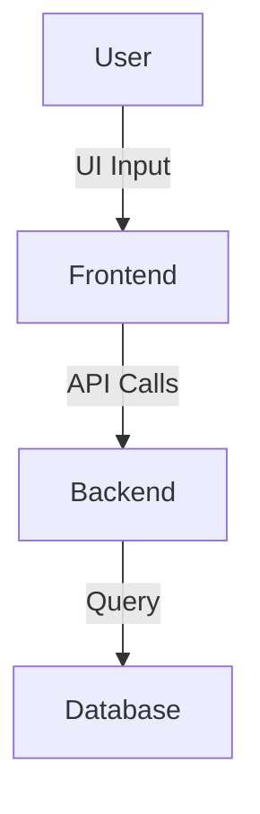

# 🚀 Project Title: Work Planner Next
## 📌 Overview
[Brief one-paragraph summary of what this project does. Describe its purpose and core functionality.]

## 🧠 Key Features
- ✅ [Web App Integration]
- ✅ [Dashboard]

## 🛠️ Technologies Used

### 💻 Frontend


### 🧩 Backend


### 🗄️ Database


## 🧩 Available Platforms
- 🌐 Web

## ⚙️ System Architecture
> _Describe how the system components interact — frontend, backend, database, and hardware._


## 📸 Screenshots / Demo

| Dashboard |
|-----------|
| 


|

## 📱 Installation & Setup

### Prerequisites
- [ ] Node.js
- [ ] Visual Studio Code

### Setup Steps
```bash
# Clone the repository
git clone https://github.com/Raghavan2005/Work-Planner.git
cd Work-Planner

# Install dependencies
npm install         # For Node.js backend

# Start the development server
npm run dev         # or node server.js

```

## 📄 License
This project is licensed under the [MIT License](LICENSE).
